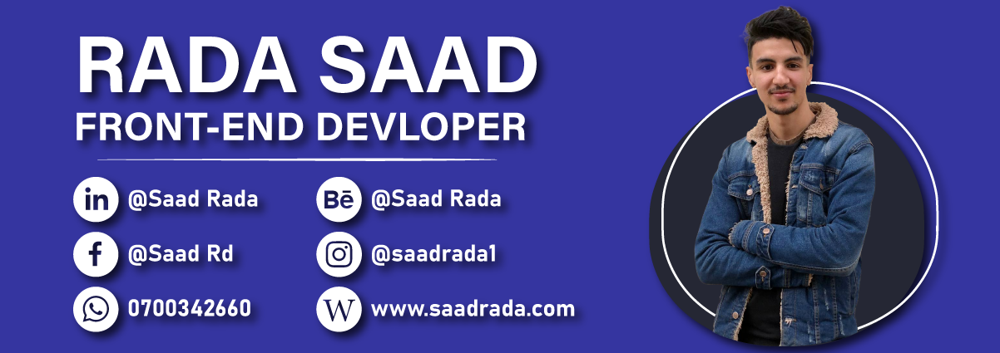

### Hi there 👋

Welcome to my own github profile
I'm **Saad Rada** from Morocco , I'm 20 years old, ambitious young man, I'm currently studying for a master's degree in full stack web development.

I’m a React Front-end web developer.
Web developing for me started as a hobby before becoming a job, So my interest and love for it always pushes me to do my best and improve every project I`m working on!

<!-- - 👨🏻‍💻 All About me in my [Resume](https://saadrada.github.io/CV/)
- 🌱 I’m currently learning ...
- 👯 I’m looking to collaborate on ...
- 🤔 I’m looking for help with ...
- 💬 Ask me about ...
- 📫 How to reach me: ...
- 😄 Pronouns: ...
- ⚡ Fun fact: ... -->
### 🛠️Technologies and Tools I use:

### ❤️ Let's get connected:

  

### if you like my work : 
- You can Star ⭐ the repositories you like.
- You can react ❤️ to my LinkedIn posts.